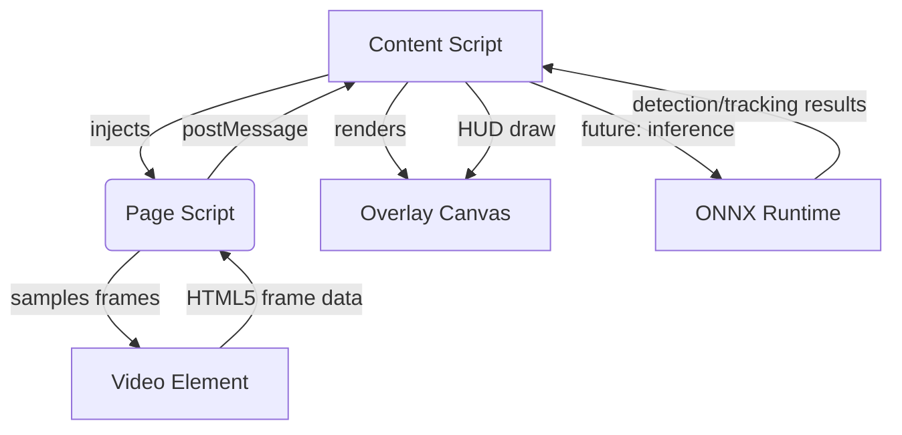

# SoccerHUD 아키텍처

## 구성 요소

### 1. Content Script (`src/content-script/`)
- YouTube `<video>` 가 있는 페이지에 캔버스 오버레이를 삽입합니다.
- `page-script/index.js` 를 주입하여 페이지 컨텍스트에서 비디오 프레임을 샘플링하도록 합니다.
- `postMessage` 로 전달된 프레임 메타데이터를 수신하여 HUD를 10 FPS 수준으로 갱신합니다.
- 향후 단계에서 ONNX Runtime Web(브라우저 내 WebGPU/WebGL/CPU)으로 추론을 수행하는 orchestrator 역할을 담당합니다.

### 2. Page Script (`src/page-script/`)
- 페이지의 주요 `<video>` 를 탐색하고 10 FPS 간격으로 프레임을 샘플링합니다.
- CORS 제약으로 인한 예외를 감지하여 Content Script에 상태를 보고합니다.
- 현재는 프레임의 타임스탬프/해상도만 전송하지만, 차후 모델 전처리를 위한 다운스케일링/버퍼링을 추가합니다.

### 3. Options 페이지 (`src/options/`)
- 팀 로스터 CSV 업로드를 위한 UI 스텁을 제공합니다.
- 추후에는 선수 번호-이름 매핑을 로컬 스토리지/Sync Storage에 저장하고 HUD에 공급합니다.

### 4. 빌드 & 번들링
- Vite 멀티엔트리 구성으로 Content Script, Page Script, Options 페이지를 각각 번들합니다.
- `public/manifest.json` 을 통해 MV3 매니페스트를 유지하며, 빌드 산출물은 `dist/` 에 생성됩니다.
- GitHub Actions 워크플로우는 타입 검사, 린트, 빌드 과정을 자동화합니다.

## 데이터 플로우 요약
1. Content Script가 로드되면 오버레이 캔버스를 생성하고 Page Script를 주입합니다.
2. Page Script가 주기적으로 비디오 프레임을 캔버스에 복제한 뒤, 성공/오류 여부와 타임스탬프를 `window.postMessage` 로 전송합니다.
3. Content Script는 메시지를 수신하여 HUD 텍스트(`Ball Carrier: Unknown`)를 갱신하고, 오류 발생 시 상태 메시지를 노출합니다.
4. 향후에는 Content Script가 샘플링된 프레임을 모델 전처리 → 추론 → 트래킹으로 연결하고 HUD에 선수 번호/이름을 표시합니다.
